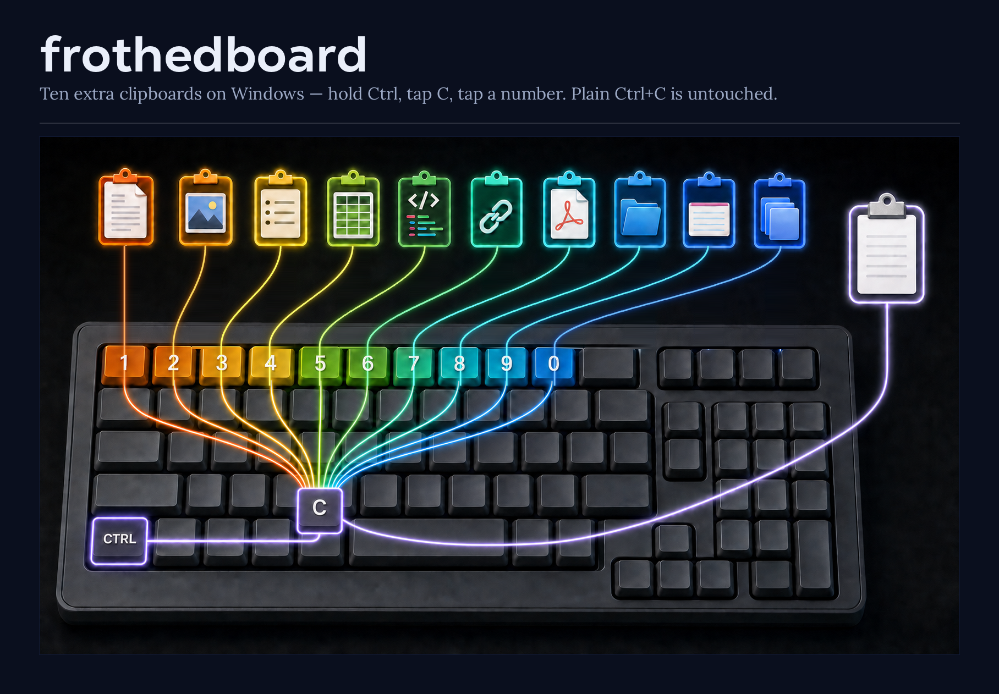

# frothedboard

Why one clipboard when eleven better



Hold **Ctrl**, tap **C**, tap **3** — that copy went to board 3.
Hold **Ctrl**, tap **V**, tap **3** — board 3 comes back.

Ten boards, plus your normal clipboard, untouched. Any digit, top row or numpad. `Ctrl+X` too.
Holds anything you can copy: text, images, files, formatted documents.

Touch no digit and `Ctrl+C` / `Ctrl+V` do exactly what they always did. That's the whole point —
the other numbered clipboards make you learn a second shortcut instead.

## Install

Windows. Grab the zip from [Releases][releases], unpack it anywhere, run `frothedboard.exe`. No
installer, no runtime. It sits in the tray. A folder rather than a lone exe so nothing leaks into
`%TEMP%`.

Portable: no files written, ever. Boards live in memory and are wiped when you quit, so they
don't survive a restart — on purpose. The one thing it writes anywhere is the opt-in *Start with
Windows* toggle, which sets a single registry value and removes it when you untick it.

## Tested so far

Text copies and pastes through the boards. Cutting files works too, and boards hold their own
payloads independently — 1 and 2 each moved a different set.

Still untried: images, formatted content, and elevated windows (an unelevated hook cannot see
them; run as admin if you need them).

## Build

Microsoft's .NET 8 SDK — Ubuntu's package won't do, it strips WindowsDesktop. Cross-builds from
Linux.

```bash
dotnet test tests/Frothedboard.Core.Tests
dotnet publish src/Frothedboard.App -c Release -r win-x64 --self-contained \
  -p:PublishSingleFile=true -p:EnableCompressionInSingleFile=true -o dist
```

MIT.

[releases]: https://github.com/Obsidiate/frothedboard/releases

## Feedback and donations

I love making things. Anything I've ever built has been to have fun, share fun, and make life a bit easier. If you got value from one of these things, and you'd like to chuck us a coffee, a bottle, or a god damned Ferrari, go your hardest. Then hustle over to discord to claim your supporter role!

[GitHub Sponsors](https://github.com/sponsors/AdamChesters) | [Buy Me a Coffee](https://buymeacoffee.com/adamch) | [Donate with PayPal](https://www.paypal.com/donate/?business=KLHSZPXTSVSAU&no_recurring=0&item_name=I%27ve+donated+to+lots+of+small+creators+for+their+useful+little+tools%2C+now+I+create+them.+Dig+one?+I%27d+love+your+support.&currency_code=AUD)

[Join the Discord](https://discord.gg/fs4WyaQPA)
